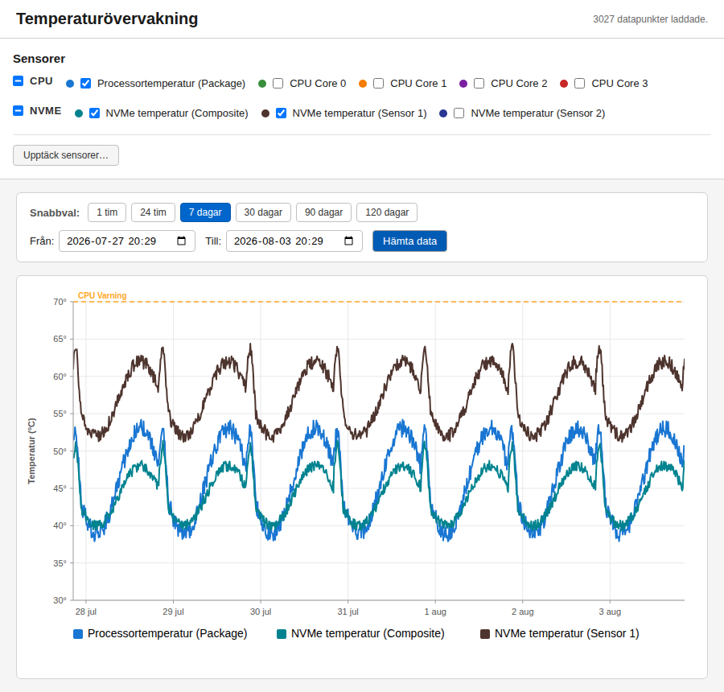

# cockpit-temps — Cockpit Temperature Monitoring Plugin

A Cockpit plugin for Ubuntu Server that visualises hardware temperature data
(CPU, NVMe, etc.) as interactive line charts with configurable thresholds.
Data is collected and archived by **PCP** (Performance Co-Pilot) via the
`pmdalmsensors` PMDA, giving you up to 120 days of history with automatic
archive rotation and disk-budget enforcement.

> This is a personal hobby project I build for my own use and publish in case
> it's useful to someone else. I work on it in my spare time, so issues and PRs
> are welcome but replies may be slow. Use at your own risk.



---

## Features

- **Historical charts** — query PCP archives up to 1 year back
- **Sensor grouping** — configurable groups (CPU, NVMe, etc.) with custom labels
- **Threshold lines** — global defaults (70 / 75 / 80 °C) plus per-sensor overrides
- **Date range controls** — quick presets (1h, 24h, 7d, 30d, 90d, 1y) and custom range
- **Auto downsampling** — step size scales with time range (1 min → 6 h)
- **Metric discovery** — UI button lists all available PCP lmsensors metrics
- **Archive rotation** — pmlogger_daily + cron-based disk budget
- **Zero external deps** — plain JS, inline SVG chart, no build step

---

## File Tree

```
cockpit-temps/
├── manifest.json              # Cockpit plugin manifest
├── index.html                 # Main HTML page
├── app.js                     # Application logic + SVG chart
├── style.css                  # Styles
└── config/
    └── sensors.json           # Sensor mapping, thresholds, retention config  ← you must edit this

scripts/
├── setup_pcp_temps.sh         # Install PCP + lmsensors PMDA + rotation
├── install_plugin.sh          # Deploy plugin into Cockpit
└── uninstall_plugin.sh        # Remove plugin (optional --purge)
```

---

## Installation

### Step 1 — Clone the repo

```bash
git clone <this-repo> cockpit-temps-repo
cd cockpit-temps-repo
```

### Step 2 — Run the PCP setup script (as root)

```bash
sudo bash scripts/setup_pcp_temps.sh
```

This will:
- Install `lm-sensors`, `pcp`, `cockpit`, `cockpit-pcp`
- Run `sensors-detect` to load kernel sensor modules
- Install the lmsensors PMDA
- Configure `pmlogger` to archive lmsensors metrics every 60 s
- Set up archive rotation (120 days retention, 10 GB max)
- Enable and start all services

**Configurable variables** (set before running or edit the script):

| Variable             | Default | Description                  |
|----------------------|---------|------------------------------|
| `RETENTION_DAYS`     | 120     | Keep archives this many days |
| `MAX_SIZE_GB`        | 10      | Max total archive disk usage |
| `PMLOGGER_INTERVAL`  | 60      | Logging interval in seconds  |

Example:

```bash
sudo RETENTION_DAYS=180 MAX_SIZE_GB=2 bash scripts/setup_pcp_temps.sh
```

### Step 3 — Configure sensors for your hardware (required)

> **This step is required on every machine.** The default `sensors.json` is
> configured for specific hardware (an Intel CPU and one NVMe drive at a
> specific PCI address). Your system will almost certainly have different metric
> names. The plugin will load but show no data until this is done.

**Find your metric names:**

```bash
pminfo -t lmsensors
```

Example output (your output will differ):

```
lmsensors.coretemp_isa_0000.package_id_0  [coretemp-isa-0000 Package id 0]
lmsensors.coretemp_isa_0000.core_0        [coretemp-isa-0000 Core 0]
lmsensors.coretemp_isa_0000.core_1        [coretemp-isa-0000 Core 1]
lmsensors.nvme_pci_0100.composite         [nvme-pci-0100 Composite]
lmsensors.nvme_pci_0100.sensor_1          [nvme-pci-0100 Sensor 1]
```

The naming convention is `lmsensors.<chip>.<feature>` where the chip name is
the adapter name from `sensors` with dashes replaced by underscores
(e.g. `coretemp-isa-0000` → `coretemp_isa_0000`).

Common hardware differences:

| Hardware         | Example chip name                    |
|------------------|--------------------------------------|
| Intel CPU        | `coretemp_isa_0000`                  |
| AMD CPU          | `k10temp_pci_00c3` (address varies)  |
| NVMe at 01:00    | `nvme_pci_0100`                      |
| NVMe at 02:00    | `nvme_pci_0200`                      |
| Second NVMe      | `nvme_pci_0300` (address varies)     |

**Edit `cockpit-temps/config/sensors.json`** to match your metric names. A
minimal example for one CPU package sensor and one NVMe:

```json
{
    "groups": [
        {
            "id": "cpu",
            "label": "CPU",
            "sensors": [
                {
                    "id": "cpu_package",
                    "label": "CPU Package",
                    "metric": "lmsensors.coretemp_isa_0000.package_id_0",
                    "default": true,
                    "thresholds": null
                }
            ]
        },
        {
            "id": "nvme",
            "label": "NVMe",
            "sensors": [
                {
                    "id": "nvme_composite",
                    "label": "NVMe Composite",
                    "metric": "lmsensors.nvme_pci_0100.composite",
                    "default": true,
                    "thresholds": [
                        { "value": 75, "label": "NVMe Composite Warning",  "color": "#FFA726" },
                        { "value": 80, "label": "NVMe Composite Critical", "color": "#E53935" }
                    ]
                }
            ]
        }
    ],
    "thresholds": {
        "global": [
            { "value": 70, "label": "Warning 70\u00b0C",  "color": "#FFA726", "style": "dashed" },
            { "value": 75, "label": "Smartd 75\u00b0C",   "color": "#FF7043", "style": "dashed" },
            { "value": 80, "label": "Critical 80\u00b0C", "color": "#E53935", "style": "dashed" }
        ]
    },
    "retention": {
        "days": 120,
        "maxSizeGB": 10
    },
    "archiveBase": "/var/log/pcp/pmlogger"
}
```

Remove sensor entries whose metrics do not exist on your hardware — they will
simply produce no data but cause no errors.

### Step 4 — Install the plugin

```bash
sudo bash scripts/install_plugin.sh
```

This also disables PCP archive compression (`$PCP_COMPRESSAFTER=never`), which
is required because `pmrep` cannot read `.xz`-compressed archives when given a
directory argument. See [PCP Archive Compression](#pcp-archive-compression-important)
for details.

Re-run this command any time you change `sensors.json`.

### Step 5 — Open Cockpit

Navigate to `https://<server-ip>:9090` and click **Temperatures** in the menu.

---

## Sensor Configuration Reference

### Global thresholds

Defined under `thresholds.global` in `sensors.json`. These horizontal lines are
drawn on every chart regardless of which sensors are selected.

### Per-sensor thresholds

Each sensor entry can include a `thresholds` array to add sensor-specific lines:

```json
{
    "id": "nvme_composite",
    "label": "NVMe Composite",
    "metric": "lmsensors.nvme_pci_0100.composite",
    "thresholds": [
        { "value": 75, "label": "NVMe Composite Warning",  "color": "#FFA726" },
        { "value": 80, "label": "NVMe Composite Critical", "color": "#E53935" }
    ]
},
{
    "id": "nvme_sensor1",
    "label": "NVMe Sensor 1 (controller chip)",
    "metric": "lmsensors.nvme_pci_0100.sensor_1",
    "thresholds": [
        { "value": 82, "label": "NVMe Sensor 1 Warning",  "color": "#FFA726" },
        { "value": 90, "label": "NVMe Sensor 1 Critical", "color": "#E53935" }
    ]
}
```

Set `"thresholds": null` to inherit only the global thresholds.

### Thresholds — NVMe sensor rationale

NVMe drives expose multiple temperature sensors that measure different physical
locations and have very different normal operating ranges:

| Sensor      | What it measures          | Normal range under load |
|-------------|---------------------------|-------------------------|
| Composite   | Drive-level aggregate      | 50–70 °C                |
| Sensor 1    | Controller chip            | 65–82 °C                |
| Sensor 2    | NAND flash                 | 50–70 °C                |

**Samsung PM9A1 (MZVL8512HELU, OEM 980 Pro Gen4):** The controller chip
(Sensor 1) routinely runs 15–20 °C hotter than the composite temperature. This
is expected behaviour — the drive begins thermal throttling only when the
*composite* temperature approaches 82 °C. The authoritative check for thermal
problems is `nvme smart-log`:

```bash
nvme smart-log /dev/nvme0 | grep -E "Warning Temperature Time|Critical Composite Temperature Time|Thermal Management T[12] Trans Count"
```

If all three fields report `0`, the drive has never throttled and the higher
Sensor 1 readings are normal. A global threshold calibrated against composite
temperatures (e.g. 75 °C) will fire false alarms for Sensor 1. Use
sensor-specific thresholds as shown above to avoid this.

### The `default` flag

Sensors with `"default": true` are pre-checked when the plugin loads. All
others must be selected manually.

---

## PCP Archive Compression (Important)

PCP archive compression **must be disabled** for this plugin to work.

`pmlogger_daily` compresses rotated PCP archives by default (`.0` → `.0.xz`,
`.meta` → `.meta.xz`) but leaves `.index` files uncompressed. When `pmrep` is
given a directory as its `-a` argument, it tries to open all archive sets found
there. The orphaned `.index` files (pointing to compressed `.0.xz`/`.meta.xz`
that pmrep cannot read) cause pmrep to fail with
`PM_ERR_NAME Unknown metric name` for every metric.

**The install script handles this automatically** by setting
`$PCP_COMPRESSAFTER=never` in `/etc/pcp/pmlogger/control.d/local`.

### If archives are already compressed

If you installed PCP before running the install script, some archives may
already be compressed. To fix this:

1. Move `.xz` files out of the archive directory:
   ```bash
   ARCHIVE_DIR=/var/log/pcp/pmlogger/$(hostname)
   mkdir -p /tmp/pcp-compressed-backup
   mv "$ARCHIVE_DIR"/*.xz /tmp/pcp-compressed-backup/ 2>/dev/null
   ```

2. Remove orphaned `.index` files (those whose matching `.0` file is missing):
   ```bash
   for idx in "$ARCHIVE_DIR"/*.index; do
       base="${idx%.index}"
       if [[ ! -f "$base.0" ]]; then
           rm -v "$idx"
       fi
   done
   ```

3. Restart pmlogger:
   ```bash
   sudo systemctl restart pmlogger
   ```

---

## Archive Rotation & Disk Budget

### How it works

1. **pmlogger_daily** runs via systemd timer (or cron) once per day:
   - Creates a new daily archive
   - Removes archives older than `RETENTION_DAYS` (`-k N`)

2. **pcp-archive-budget** cron script (`/etc/cron.daily/pcp-archive-budget`):
   - Checks total archive size per host
   - If over `MAX_SIZE_GB`, removes oldest archive sets until under budget

### Verification commands

```bash
# Check archive size
du -sh /var/log/pcp/pmlogger/$(hostname)/

# List archive files
ls -lhS /var/log/pcp/pmlogger/$(hostname)/ | head -20

# Check pmlogger_daily timer
systemctl list-timers | grep pmlog

# Check retention config
cat /etc/default/pmlogger    # or /etc/sysconfig/pmlogger

# Manually trigger budget enforcement (safe to run)
sudo bash /etc/cron.daily/pcp-archive-budget
```

### Adjusting retention after install

Edit `/etc/default/pmlogger` (or `/etc/sysconfig/pmlogger`):

```bash
PMLOGGER_DAILY_PARAMS="-E -k 180 -x 0"   # 180 days
PCP_MAX_SIZE_GB=3                          # 3 GB budget
```

Then restart: `sudo systemctl restart pmlogger`

---

## Troubleshooting

### Plugin doesn't appear in Cockpit menu

```bash
ls -la /usr/share/cockpit/cockpit-temps/
cat /usr/share/cockpit/cockpit-temps/manifest.json
sudo systemctl restart cockpit.socket
```

### Chart shows no data / "No data points found"

Work through this checklist in order:

1. **Check that PCP services are running:**
   ```bash
   systemctl status pmcd pmlogger
   ```

2. **Check that archives exist and contain data:**
   ```bash
   ls /var/log/pcp/pmlogger/$(hostname)/
   pmrep -a /var/log/pcp/pmlogger/$(hostname)/ -o csv -H -t 60sec \
     -S "-10minutes" lmsensors.coretemp_isa_0000.package_id_0
   ```

3. **Check that the metric names in `sensors.json` match your hardware:**
   ```bash
   pminfo -t lmsensors
   ```
   If the names differ, update `sensors.json` and re-run `install_plugin.sh`.

4. **If archives are empty**, wait a few minutes — pmlogger needs time after
   startup to write the first data points.

### pminfo shows no lmsensors metrics

```bash
# Reinstall the PMDA
cd /var/lib/pcp/pmdas/lmsensors
sudo ./Remove
sudo ./Install
sudo systemctl restart pmcd
pminfo lmsensors
```

### Archive disk usage growing too large

```bash
du -sh /var/log/pcp/pmlogger/$(hostname)/
sudo bash /etc/cron.daily/pcp-archive-budget
sudo sed -i 's/-k [0-9]*/-k 90/' /etc/default/pmlogger
sudo systemctl restart pmlogger
```

---

## Acceptance Tests

### 1. Sensors detected

```bash
sensors
# Expected: output showing your hardware adapters (coretemp, nvme, k10temp, etc.)
```

### 2. PCP lmsensors metrics available

```bash
pminfo -t lmsensors
# Expected: list of lmsensors.* metric names matching your hardware
```

### 3. Live data via pmval

```bash
# Replace the metric name with one from your pminfo output
pmval -s 3 -t 2sec lmsensors.coretemp_isa_0000.package_id_0
# Expected: 3 temperature samples, e.g. 55.000, 56.000, 55.000
```

### 4. Archive data exists

```bash
# Wait a few minutes after setup, then:
pmrep -a /var/log/pcp/pmlogger/$(hostname)/ -o csv -H -t 60sec \
  -S "-10minutes" lmsensors.coretemp_isa_0000.package_id_0
# Expected: CSV rows with timestamps and temperature values
```

### 5. UI smoke test (manual)

1. Open Cockpit → Temperatures
2. Select a sensor checkbox
3. Choose a time preset → click **Fetch data**
4. **Expected:** line chart renders with data points
5. Hover over the chart → tooltip shows timestamp and temperature value
6. Threshold lines are visible

### 6. Survives reboot

```bash
sudo reboot
# After reboot:
systemctl is-active pmcd pmlogger cockpit.socket
# Expected: all "active"
```

---

## Uninstall

```bash
# Remove plugin only
sudo bash scripts/uninstall_plugin.sh

# Remove plugin + PCP config (archives are preserved)
sudo bash scripts/uninstall_plugin.sh --purge
```

---

## License

MIT

## Part of a Cockpit plugin suite

I build a small family of Cockpit plugins for home servers, all
dependency-light and made to be readable at a glance:

- **cockpit-temps** — hardware temperature history with thresholds *(this plugin)*
- [cockpit-smart](https://github.com/cgillinger/cockpit_smart) — S.M.A.R.T. disk health with trend tracking
- [cockpit-pcloud](https://github.com/cgillinger/cockpit-pcloud) — pCloud storage quota and backup folder status
- [cockpit-tailscale](https://github.com/cgillinger/cockpit_tailscale) — plain-language Tailscale network overview

Browse them all via the [cockpit-plugin topic](https://github.com/search?q=user%3Acgillinger+topic%3Acockpit-plugin&type=repositories).
